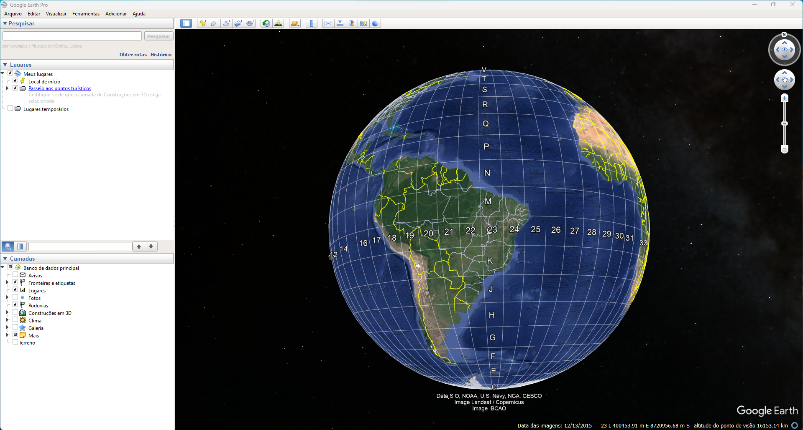
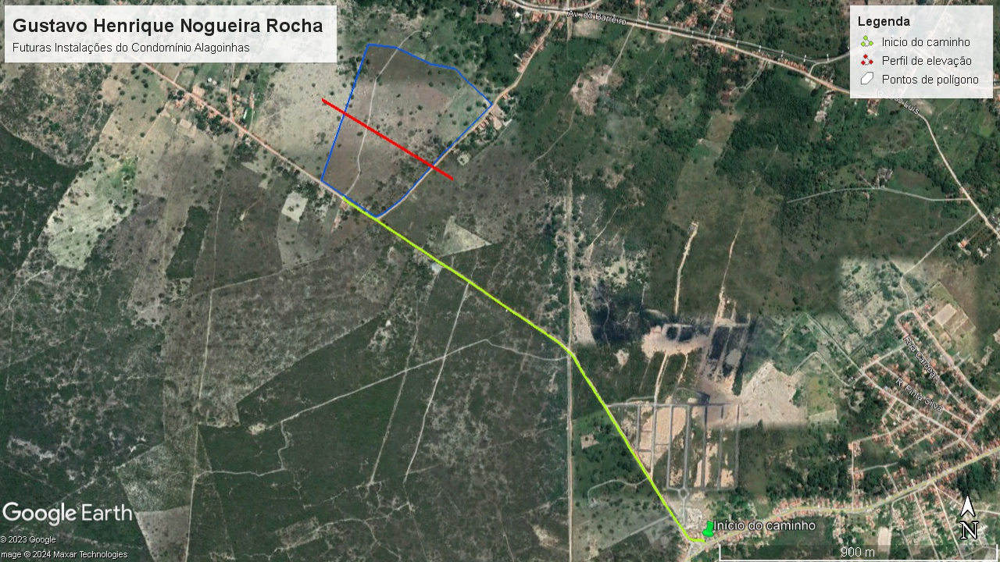

# Exibindo mapas e explicando um pouco sobre GOOGLE EARTH PRO :bulb::books:
    

Através desse Arquivo markdown exibirei alguns dos meus projetos de mapas autorais no Google Earth Pro.

## O que é o Google Earth Pro :writing_hand:

O Google Earth Pro é uma aplicação de desktop gratuita que oferece recursos avançados para usuários com necessidades específicas. Com este aplicativo, você pode importar e exportar dados GIS e explorar imagens históricas. A versão mais recente do aplicativo está disponível em PC, Mac ou Linux. Para instalá-lo, basta baixar o arquivo .exe do [Site oficial](https://www.google.com/earth/about/versions/) e executá-lo a instalação é rápida e simples.
    

## Todos os mapas do meu portifólio: :heavy_check_mark:

## Área para instalação de um condomínio no município de Alagoinhas.

 
 *Fonte: Gustavo Rocha.*

# Mapa de Supressão Vegetal
***Descrição:*** Mapas que mostram áreas onde houve a remoção da cobertura florestal ao longo do tempo.

***Como fazer:*** Compare imagens de satélite de diferentes anos para identificar áreas onde a vegetação foi removida. As áreas desmatadas podem ser destacadas em um mapa, mostrando a progressão do desmatamento
## Mapa de Supressão Vegetal - 01-2003

 
*Fonte: Gustavo Rocha*

## Mapa de Supressão Vegetal - 02-2008

*Fonte: Gustavo Rocha*

Ocorreu uma supressão com um total de área de 161,167 m²

## Mapa de Supressão Vegetal - 05-2014

*Fonte: Gustavo Rocha*

Ocorreu uma supressão com um total de área de 257,454 m²

## Mapa de Supressão Vegetal - 04-2020

*Fonte: Gustavo Rocha*

Ocorreu uma supressão com um total de área de 167,619 m²

Entre 2003 e 2020 a área sofreu um total de 586,24 m² de supressão de vegetação.

# Mapa de Contaminação de Área

***Descrição:*** Mapas que identificam áreas contaminadas por substâncias químicas, resíduos industriais, ou outras fontes de poluição que impactam o solo, a água ou a vegetação.

***Como fazer:*** Compare imagens de satélite de diferentes anos para detectar mudanças visíveis na vegetação, coloração do solo, ou presença de manchas que possam indicar a contaminação. Áreas próximas a indústrias, lixões ou zonas agrícolas com uso intensivo de pesticidas são locais típicos de estudo.

## Mapa de Contaminação de Área - 01-2019

*Fonte: Gustavo Rocha*

## Mapa de Contaminação de Área - 02-2019

*Fonte: Gustavo Rocha*

## Mapa de Contaminação de Área - 07-2022

*Fonte: Gustavo Rocha*

## Mapa de Contaminação de Área - 02-2024

*Fonte: Gustavo Rocha*

Construída em 1976 para a contenção de rejeitos gerados no beneficiamento do minério de Ferro na Mina Córrego do Feijão. O rompimento da barragem em Brumadinho, ocorrido em janeiro de 2019, resultou em uma das maiores catástrofes ambientais e humanas do Brasil. A liberação de uma enorme quantidade de rejeitos de mineração devastou a região, causando perda de vidas, destruição de comunidades e graves impactos ao meio ambiente. A lama tóxica que se espalhou pela área contaminou o solo, corpos d'água e ecossistemas, deixando um rastro de degradação que exigiu respostas urgentes para recuperação. A barragem possuia 86 metros de altura na data do rompimento. O rejeito é formado basicamente por ferro, sílica e água.

A recuperação das áreas afetadas por esse desastre envolve diversas técnicas. Para que a recuperação ambiental aconteça, o primeiro passo é a contenção e remoção dos rejeitos, essencial para evitar que os materiais contaminantes continuem a se espalhar e causar danos adicionais. Após, utiliza-se de uma técnica chamada fitorremediação utilizada para descontaminar o solo, essa técnica consiste em utilizar plantas que têm a capacidade de absorver metais pesados e outras substâncias tóxicas presentes nos rejeitos.

O reflorestamento com espécies nativas é outra técnica fundamental, pois auxilia na recuperação da cobertura vegetal, que é crucial para a restauração dos ecossistemas locais e para a prevenção da erosão. Em paralelo, a recuperação de corpos d'água envolve a remoção de sedimentos contaminados e a reintrodução de espécies aquáticas nativas para restabelecer o equilíbrio ecológico dos rios e lagos afetados, segundo a empresa foi contruida uma Estação de Tratamento de Água Fluvial. Álem, do monitoramento da fauna afiinal os animais são fundamentais para o equilíbrio dos ecossistemas e a melhoria dos processos de recuperação, uma vez que atuam como importantes agentes polinizadores e dispersores de sementes.

Além dessas ações, é necessária um monitoramento contínuo para garantir que as técnicas de recuperação sejam eficazes e que qualquer novo impacto possa ser rapidamente identificado e mitigado. A recuperação completa da área é um processo que demanda tempo e esforço, e envolve a colaboração de especialistas, comunidades locais e órgãos governamentais para restaurar a região e minimizar os efeitos a longo prazo do desastre.
